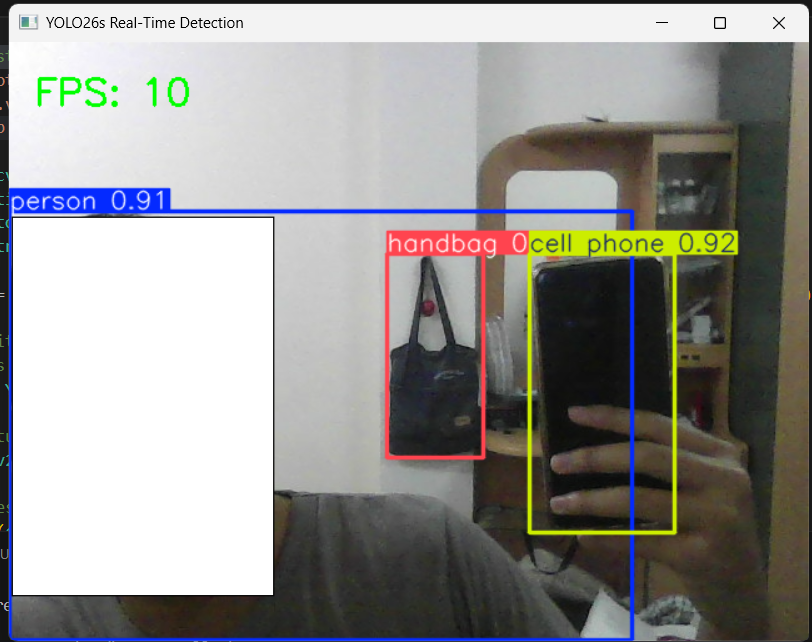

# Testing YOLO detector
What I learn:
- Python environment management (venv)
- Performance optimization in real-time systems via use of gpu instead of cpu
- Working with pre-trained deep learning models (YOLO26)
- Video stream processing with OpenCV




How to use: 
1. download the pretrain model e.g. yolo26s.pt, yolov8n.pt
2.
``` Command
pip install ultralytics opencv-python
```
